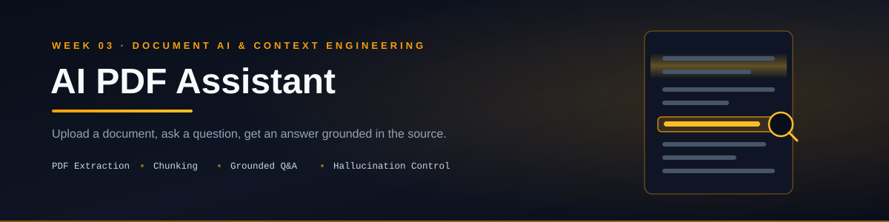

<p align="center">
  
</p>

<p align="center">
  
  
  
  
  
  
  
</p>

<p align="center">
  Upload a PDF, ask a question, and get an answer grounded in the document — not the model's imagination.<br/>
  Third deliverable of a <b>90-day AI Engineering roadmap</b> (Phase 1: Foundation, Week 3).
</p>

---

## 📑 Table of Contents

- [Overview](#-overview)
- [Features](#-features)
- [Demo](#-demo)
- [Installation](#️-installation)
- [How to Run](#️-how-to-run)
- [Architecture](#️-architecture)
- [Reliability Approach](#-reliability-approach)
- [Folder Structure](#-folder-structure)
- [Future Improvements](#-future-improvements)
- [Roadmap Context](#-roadmap-context)
- [Author](#-author)
- [License](#-license)

---

## 📖 Overview

**AI PDF Assistant** takes an uploaded PDF, extracts and chunks its text, and answers user questions **grounded strictly in the document's content**. This week's core skill is context engineering — feeding an LLM external information correctly, chunking large documents to fit context windows, and constraining the model to say "I don't know" rather than hallucinate when the answer isn't present.

This is **Repo 3 of 10+** in a structured 90-day AI Engineering roadmap, moving from LLM fundamentals → agentic systems → deployable AI products.

---

## ✨ Features

- 📄 **PDF Upload** — safe file handling with type validation and a text preview
- 🔍 **Text Extraction** — reads text from PDF pages using `pypdf`
- ✂️ **Text Chunking** — splits large documents into manageable, overlapping chunks to respect context window limits
- 💬 **Document Q&A** — ask natural-language questions about the uploaded PDF
- 🛡️ **Grounded Answers** — the assistant answers only from the provided document context, and explicitly says when it can't find something
- 🧪 **Tested against 10+ cases** — including edge cases like empty PDFs, scanned PDFs, and questions outside the document's scope

---

## 🎥 Demo

*(Add a screenshot or short GIF/video here once available)*

```
assets/screenshots/
```

---

## 🛠️ Installation

```bash
# 1. Clone the repository
git clone https://github.com/Hamna-Munir/03-AI-PDF-Assistant.git
cd 03-AI-PDF-Assistant

# 2. Create a virtual environment
python -m venv venv
source venv/bin/activate      # On Windows: venv\Scripts\activate

# 3. Install dependencies
pip install -r requirements.txt

# 4. Configure environment variables
cp .env.example .env
# then add your API key
```

---

## ▶️ How to Run

```bash
streamlit run src/app.py
```

Once running, open the local URL Streamlit prints (usually `http://localhost:8501`), upload a PDF, and start asking questions.

---

## 🏗️ Architecture

```
User uploads PDF
       │
       ▼
pdf_reader.py       — extracts raw text from each page
       │
       ▼
chunking.py         — splits text into overlapping chunks
       │
       ▼
User's question + relevant chunk(s)
       │
       ▼
prompts.py           — builds a grounded Q&A prompt
       │
       ▼
assistant.py         — sends prompt + context to the LLM
       │
       ▼
Answer shown in Streamlit UI (app.py)
```

---

## 🛡️ Reliability Approach

This assistant is explicitly instructed to stay inside the boundaries of the uploaded document:

> Answer only from the provided PDF context. If the answer is not present, say that you could not find it in the document.

This is tested directly — for example, asking about information that doesn't exist in the PDF (like a CEO's name in a document that never mentions one) should produce:

> "I could not find this information in the provided document."

Saying "I don't know" correctly is treated as a reliability feature, not a failure.

---

## 📂 Folder Structure

```
03-AI-PDF-Assistant/
│
├── README.md
├── LICENSE
├── .gitignore
├── requirements.txt
├── .env.example
│
├── docs/
│   └── week-03-summary.md
│
├── notes/
│   ├── day-15.md
│   ├── day-16.md
│   ├── day-17.md
│   ├── day-18.md
│   ├── day-19.md
│   ├── day-20.md
│   └── day-21.md
│
├── assets/
│   ├── banner.svg
│   └── screenshots/
│
├── data/
│   └── sample.pdf
│
├── tests/
│   ├── test_pdf_reader.py
│   └── test_chunking.py
│
├── src/
│   ├── app.py
│   ├── config.py
│   ├── pdf_reader.py
│   ├── chunking.py
│   ├── prompts.py
│   ├── assistant.py
│   └── utils.py
│
└── journal.md
```

---

## 🚀 Future Improvements

- [ ] Add embeddings-based retrieval instead of naive chunk selection (Phase 2 preview)
- [ ] Support multi-page scanned PDFs via OCR
- [ ] Add source page citation to each answer
- [ ] Support multiple PDFs in one session
- [ ] Deploy as a hosted Streamlit app

---

## 🧭 Roadmap Context

This project is **Week 3 of Phase 1** in a 90-day AI Engineering roadmap:

| Phase | Focus | Days |
|---|---|---|
| Phase 1 | Foundation — AI Personal Assistant → AI Writing Assistant → AI PDF Assistant | 1–30 |
| Phase 2 | Agent Engineering — RAG, LangGraph, MCP | 31–60 |
| Phase 3 | Business AI Systems — Multi-Agent, Deployment | 61–90 |

---

## 👩‍💻 Author

**Hamna Munir**
Software Engineering & AI/ML Student | Building deployable AI/ML projects

- GitHub: [@Hamna-Munir](https://github.com/Hamna-Munir)
- Hugging Face: [@Hamna27](https://huggingface.co/Hamna27)

---

## 📄 License

This project is licensed under the MIT License — see the [LICENSE](LICENSE) file for details.
